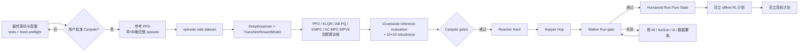

# DMC Benchmark 迁移计划（AC-MPC → DeepMind Control Suite）

> 2026-08-12 执行更新：正式比较已迁到独立分支
> `experiment/mujoco-playground` 的 GPU-native MuJoCo Playground/Warp 线路。
> CPU dm_control 实现保留为协议与迁移对照，不与 Playground 的 float32
> GPU 分数混报。当前 Cartpole 的 lift=10 Koopman 已完成，KMPC、AB-PQ、
> AC-MPC-MPVE 正式训练中；其余四任务由
> `experiments.playground.run_remaining_tasks` 按 Reacher → Hopper → Walker →
> Humanoid 自动顺序执行，中间不再要求人工 approval。

## 当前 Playground 正式参数

标准 PPO 直接读取固定 Playground commit `d5e6b475` 的任务级
`brax_ppo_config`：Cartpole/Reacher/Hopper/Humanoid 请求 60M steps，Walker
请求 100M steps；统一使用 2048 env、unroll 30、32 minibatches、每批 16
updates、learning rate `1e-3`、discount `0.995`、entropy cost `0.01`。框架因
batch 对齐产生的 effective steps 按 checkpoint 实际值报告。

| 任务 | obs | 额外 lift | Koopman horizon | KMPC horizon | MPVE horizon | MPVE reward |
|---|---:|---:|---:|---:|---:|---|
| CartpoleSwingup | 5 | 10 | 50 / 0.50 s | 20 / 0.20 s | 10 / 0.10 s | exact observation oracle |
| ReacherHard | 6 | 10 | 25 / 0.50 s | 10 / 0.20 s | 5 / 0.10 s | exact observation oracle |
| HopperHop | 15 | 24 | 25 / 0.50 s | 10 / 0.20 s | 5 / 0.10 s | learned reward model |
| WalkerRun | 24 | 32 | 20 / 0.50 s | 8 / 0.20 s | 4 / 0.10 s | learned reward model |
| HumanoidRun | 67 | 96 | 20 / 0.50 s | 8 / 0.20 s | 4 / 0.10 s | exact observation oracle |

每项先训练标准 PPO，再从 early/mid/late checkpoint 各采 1M complete
transitions（总计 3M），训练 Koopman，最后并行训练 KMPC、AB-PQ 和
AC-MPC-MPVE。所有方法的 critic 仍输入标准化原始 observation；只有
structured actor 使用 lifted state。Reacher/Humanoid exact oracle 已分别用
4 条真实 GPU transition 验证最大绝对 reward 误差为 0；Hopper/Walker 不把
缺少直接观测量的 reward 伪称为 exact。

> 更新：2026-08-10
>
> 当前状态：Cartpole data-source PPO、300k dataset 与 Koopman best 已产生；actor comparison 改用独立统一 seed，正在刷新精简后的 lineage 验收。当前结果仍是 development 调试，不是 benchmark 结论。
> 执行约束：task/config、环境协议与 artifact 内容哈希是硬边界；source identity 只作为复现 provenance，不再把数据采集、Koopman 与 actor 锁成同一个审批链。CPU worker 数属于执行参数，可独立调整。

## 1. 目标与边界

把已在 Hopper Hop 工作中验证过的 DeepKoopman、可微 DARE、KLQR、AB-PQ、KMPC 和 PPO 训练基础迁移到 [DeepMind Control Suite](https://github.com/google-deepmind/dm_control)，按

`Cartpole Swingup → Reacher Hard → Hopper Hop → Walker Run`

形成 smooth → nonlinear → contact → strong contact + locomotion 的递进证据。Walker 是进入 Humanoid 前的决策门槛；通过后再运行用户指定的 `Humanoid Run Pure State` 高维压力测试。67 维标准 `humanoid_run` 仅作为可选公开基准对照，不默认与 pure-state 一起执行。

如果这些任务均验证可行，下一阶段才讨论 offline RL，之后再讨论真机。DMC transition schema 因而从现在开始保留 reward、discount、terminated/truncated 和数据 lineage，而不只保存动力学三元组。

## 2. 冻结候选环境协议：`dmc_native_v1`

主结果使用 `dm_control==1.0.44` 的 native control timestep、`action_repeat=1`、官方 state observation、官方 reward 和 1000 control steps/episode。

| 阶段 | 任务 | obs | act | native control | episode | 角色 |
|---|---|---:|---:|---:|---:|---|
| 1 | `cartpole_swingup` | 5 | 1 | 0.01 s / 100 Hz | 10 s / 1000 steps | 最低成本全链路验证 |
| 1 | `reacher_hard` | 6 | 2 | 0.02 s / 50 Hz | 20 s / 1000 steps | 非线性、近稀疏奖励 |
| 2 | `hopper_hop` | 15 | 4 | 0.02 s / 50 Hz | 20 s / 1000 steps | 单腿接触 |
| 3 | `walker_run` | 24 | 6 | 0.025 s / 40 Hz | 25 s / 1000 steps | 决策门槛 |
| 4a | `humanoid_run_pure_state` | 55 | 21 | 0.025 s / 40 Hz | 25 s / 1000 steps | 高维纯状态压力测试 |
| 4b | `humanoid_run`（可选） | 67 | 21 | 0.025 s / 40 Hz | 25 s / 1000 steps | 标准 observation 对照 |

原计划中 Cartpole/Reacher 的“20 Hz、200/400 步”不属于当前原生规格。特别是 Reacher 的 physics timestep 为 0.02 s，0.05 s 不是整数倍，不能用交替 2/3 substeps 构造时变离散动力学。未来若匹配某篇论文的 action-repeat，必须另建具名 protocol/config，不能与 `dmc_native_v1` 混报。

## 3. 五种方法与公平比较边界

| 方法 | actor | critic 训练 | Koopman 依赖 |
|---|---|---|---|
| `PPO` | Acme-reference MLP policy | 标准 PPO + GAE | 否 |
| `KLQR` | cost map → 可微 DARE → affine LQR | 标准 PPO + GAE | 是 |
| `AB-PQ` | 低秩二次 value，经冻结 A/B 贪心求动作 | 标准 PPO + GAE | 是 |
| `KMPC` | cost map → 有限时域 box-QP | 标准 PPO + GAE | 是 |
| `AC-MPC-MPVE` | **与 KMPC 完全相同的 actor** | 标准 PPO + GAE，另加 detached MPC 轨迹上的 critic TD-k 回归 | Cartpole 用官方解析 reward；learned model 仅消融/fallback |

第五方法是严格的 `KMPC vs AC-MPC-MPVE` critic-training 消融：actor 构造、MPC horizon、求解器、PPO 超参和环境步预算均不变。它不是另一个更大的 actor，也不是把 PPO 的真实 GAE 换成模型回报。

所有方法的 critic 统一输入标准化的原始 DMC observation，网络结构相同；只有 structured actor/controller 使用 Koopman lifted state。不同 actor 保留符合自身参数化的初始化，critic 则在 actor 构造后使用独立的共同 seed 初始化。MPVE 在预测轨迹上先把 lifted state 经 `koopman.reconstruct()` 映回标准化 observation，再计算 `V(ŝ)`，不把 learned lift 特征额外提供给 critic。

### 3.1 Model-Predictive Value Expansion

依据 Romero et al. 的 [AC-MPC / MPVE（TRO 2025）](https://rpg.ifi.uzh.ch/docs/TRO25_ACMPC_Romero.pdf)，KMPC 求解时已经得到预测动作序列与 Koopman 预测状态轨迹。Cartpole 对每个真实 rollout 起点，从 horizon-20 MPC 轨迹取 `H=10` 并在 rollout 边界 detach：

\[
\hat y_h = \sum_{j=h}^{H-1}\gamma^{j-h}\hat r_j
             + \gamma^{H-h}V(\hat s_H),\qquad h=0,\ldots,H-1.
\]

标准 PPO value loss 保留；额外项是在所有预测深度上回归 `V(ŝ_h)` 到 `ŷ_h` 的均方 TD-k loss。梯度边界必须满足：

- MPC 预测状态/动作、预测 reward 和末端 bootstrap target 全部 detach；
- MPVE 附加损失只更新 critic，不更新 KMPC actor、Koopman 或 reward model；
- actor 仍只通过原来的 PPO surrogate 更新，因此比较隔离的是“是否用 MPC 预测轨迹辅助 critic”。

### 3.2 官方 reward oracle 与 learned fallback

Cartpole 主实验从预测的官方 5D next observation 与 applied action 直接计算 `dm_control` dense reward，并要求 preflight 逐 transition 最大绝对误差 `≤2e-7`。这是 MPVE 的 primary reward source。

Koopman 阶段仍同时训练 `TransitionRewardModel`：输入归一化的 `(state, applied_action, next_state)`，输出 DMC `[0,1]` reward 预测。训练目标为

`Koopman dynamics objective + reward_loss_weight × reward MSE`。

validation 同时记录动力学 rollout normalized MSE 与 reward MSE/RMSE/MAE。best/latest checkpoint 都保存 Koopman、reward model、normalizer 和 lineage；可续训的 latest 另存 optimizer/RNG/history。learned model 只用于显式 ablation 或无法通过 exact parity 的任务。每个任务开始前先审计 observation 是否足以复现官方 reward；exact 与 learned 两条路径必须写入 config/checkpoint，不能混报。

## 4. 参考 PPO：Acme 当前官方示例口径

DMC 没有一套“官方最优/SOTA PPO 超参数”。主 PPO 因此采用 Google DeepMind Acme 当前 continuous-control PPO 示例作为**官方参考实现口径**，固定到 commit [`770bc75e`](https://github.com/google-deepmind/acme/tree/770bc75e)。这意味着“reference”，不意味着 Acme 对 `cartpole_swingup` 做过任务级最优调参，也不能写成 DMC 官方 best。

对应主来源：[run_ppo.py](https://github.com/google-deepmind/acme/blob/770bc75e/examples/baselines/rl_continuous/run_ppo.py)、[PPO config](https://github.com/google-deepmind/acme/blob/770bc75e/acme/agents/jax/ppo/config.py)、[PPO networks](https://github.com/google-deepmind/acme/blob/770bc75e/acme/agents/jax/ppo/networks.py) 与 [PPO learner](https://github.com/google-deepmind/acme/blob/770bc75e/acme/agents/jax/ppo/learning.py)。DMC v2 的候选参数为：

- policy 和 value 各为 `3 × 256 ReLU`；policy 使用 state-dependent location/scale 的 tanh-squashed diagonal Gaussian，evaluation 取 distribution mode；
- observation normalization；advantage 采用零偏差修正 EMA 的 `mean(abs(A))` 作尺度并相除（`tau=0.995`，不做 batch z-score/去中心）；value 使用 running statistics 归一化，GAE 前反归一化、critic target 再归一化；
- `256 sequences × unroll 8 = 2048 transitions/update`，8 个 256-transition minibatches，2 epochs；
- `gamma=0.99`、`GAE lambda=0.95`、PPO clip `0.2`、constant learning rate `3e-4`、Adam `eps=1e-7`、entropy cost `3e-4`、value cost `1.0`、gradient norm `0.5`；不启用 value clipping 或 reward clipping；
- Acme 官方示例的公开参考预算仍是约 1M steps；Cartpole 的首次 1M 诊断未达到预期 return 后，当前 development comparison 按用户决定扩到 `9,998,336 = 4,882 × 2,048` environment steps。该扩展用于判断训练长度效应，不声称是 Acme 官方预算；
- 配置登记 `diagnostic_every_steps=50,000`。训练中诊断不能用于挑选主 checkpoint；若实际启用额外 evaluation，其环境步须单独记账。

历史 [CleanRL continuous PPO 实现](https://github.com/vwxyzjn/cleanrl/blob/cbd83f623bd1985af5628ff1609b6a3ddd527df6/cleanrl/gymnasium_support/ppo_continuous_action.py) 的结果页报告 [`640.86 ± 11.44`](https://github.com/vwxyzjn/cleanrl/blob/fe8d8a03c41a7ef5b523e2e354bd01c363e786bb/docs/rl-algorithms/ppo.md#ppo_continuous_actionpy)，这里只保留为 compatibility anchor：它来自旧 `dm-control/Shimmy/Gymnasium` 栈、不同的 2×64 Tanh/分布/归一化/rollout 配置，并统计在线随机策略的 last-100 training episode return。它不能与本项目固定 checkpoint 的 deterministic post-evaluation 直接等同，也不能被当作 PPO 达标线。

## 5. 完整实验 DAG

数据源 PPO 与 comparison PPO 可以使用不同 seed。冻结 Koopman 必须保留自己的 dataset/config/approval lineage；后续 PPO、KMPC、AB-PQ、AC-MPC-MPVE 则共享一个新的 actor-training seed 和 actor approval。公平比较要求 actor seed 相同，不要求数据/model seed 与 actor seed 相同。主数据按 early/mid/late 覆盖并只持久化完整 episode。

### 执行效率

DMC 环境仍是 CPU MuJoCo，但 vector runner 不再在一个 Python 循环中顺序推进全部环境。默认将 256 env 分片到 16 个 spawn workers；`--env-workers N` 可直接调核，不修改 YAML、protocol 或 artifact identity。本机 Cartpole probe 为：1 worker 约 2.0k transitions/s，8 workers 约 11.3k/s，16 workers 约 12.5k/s，32 workers 约 10.4k/s，因此默认 16。环境构建也由约 23.6 s 降至约 4.2 s。

## 6. 评估与统计口径

- 主最终评估：固定预算结束的 `latest.pt`，deterministic policy，10 个预注册 evaluation seeds 各 1 episode，共 10 episodes；这是与 Acme 示例“10 episodes”数量对齐的 reference summary。
- robustness：同一批固定 seeds 各跑 10 episodes，共 100 episodes；主评估就是每个 seed 的第一条预注册 episode，不额外重复收费。
- `best.pt` 只用于诊断，不允许看完结果后替换主 checkpoint。
- development 只有 1 个 training seed，只报告描述统计，并把 training-seed std/SE/CI 标成不可估。benchmark 才使用 3 个独立 training seeds 和 Student-t 95% CI；100 个 evaluation episodes 不能冒充 100 次独立训练。
- benchmark 首轮可使用参考 PPO seeds 汇总数据训练一个共享 Koopman/reward checkpoint；此时 CI 只表示给定共享模型时的 policy-training 不确定性。每 seed 独立 dataset→model→actor 是后续全链 robustness ablation。

## 7. Cartpole development 工作量

| 项 | 数量 |
|---|---:|
| 每 actor 训练 | 9,998,336 steps（4,882 updates） |
| 本轮四方法训练 | `4 × 9,998,336 = 39,993,344` steps |
| robustness evaluation 上限 | `4 × 10 seeds × 10 episodes × 1000 = 400,000` steps |
| 训练 + robustness evaluation | **40,393,344 steps** |
| 参考 PPO 数据 hard cap | 300,000 complete-episode transitions |

300,000 是采集安全上限，不是保证写满的数量；实际完整 episode 数、train/validation/test split 和 K-step lazy windows 必须由 dataset builder artifact 确认。若 comparison PPO 使用独立 seed，其训练预算与先前 data-source PPO 分开记账，不能再声称数据采集“包含在 PPO peer 预算内”。

benchmark 是否继续使用公开约 1M 预算，或采用 development 的 10M 延长预算，必须在 development 结果后单独预注册；不能把两个预算下的结果混报。evaluation 和任何 50k 诊断开销另行按实际执行记账。

## 8. 训练前硬 Gate

任何 Cartpole optimizer step 开始前，必须完成并向用户提交：

1. 最终 source/config tree 的全量测试和 fresh real preflight；
2. `dmc_native_v1` 协议、Acme-reference PPO 参数、五方法清单与 MPVE gradient boundary；
3. 训练/评估预算、预计资源、输出目录、完整启动命令和现有机器作业避让方案；
4. 六任务 suite parity、reward probe、timeout bootstrap、collector crash-resume、split 无泄漏、reward/Koopman/actor checkpoint round-trip；
5. 下列 proposed gates 的接受或调整。

Cartpole 候选 gates：

- PPO 10-episode reference mean return ≥ 750/1000；
- Koopman validation K=50 rollout normalized MSE ≤ 0.25；
- 同一 rollout 上 model RMSE / zero-order-hold RMSE ≤ 0.70；
- TransitionRewardModel validation RMSE ≤ 0.05；
- KMPC mean return / PPO mean return ≥ 0.90；
- AC-MPC-MPVE mean return / KMPC mean return ≥ 1.00；
- deterministic applied-action saturation fraction ≤ 0.50。

这些都是 **proposed**，用于预先决定是否进入下一环境，不能看见结果后回填。由于 schema/source 已变化，2026-08-09 的旧 preflight、hash、吞吐和 microbenchmark 数字均不可作为启动证据；即使目录中残留旧 approval，也必须由审批验证器因 fingerprint 不一致而拒绝。只有用户审核 fresh artifact 后，才能创建绑定最终字节的 approval 并启动参考 PPO。

## 9. 后续阶段 Gate

- 每一环境先跑单 training seed development；环境、数据、动力学、reward model 和控制指标全部通过后，才扩到 3-seed benchmark。
- Reacher/Hopper/Walker 严格串行过 gate；Walker 同时满足动力学和控制 gate 才进入 Humanoid。
- DMC 使用原生默认接触保证可比性；柔顺接触研究线独立留给 sim2real/真机。
- Humanoid 前必须对 lazy/streaming dataset 做存储压测，禁止实体化百万级重叠窗口。
- offline RL 与真机不属于当前 DMC 首训授权；届时另立数据治理、安全和真实系统验证计划。
